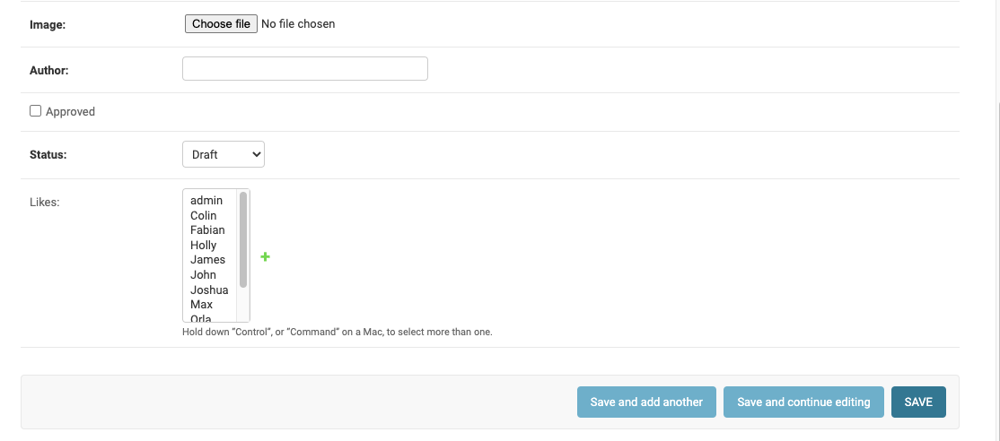
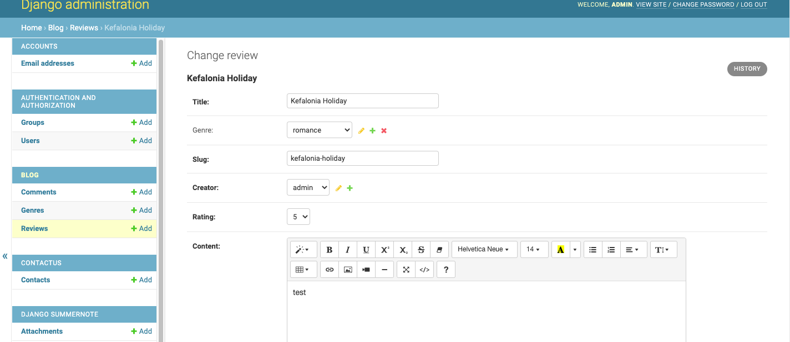
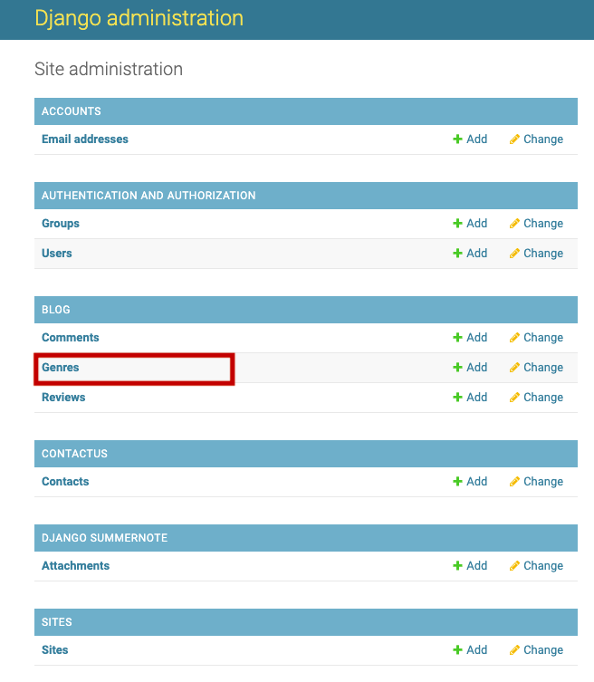
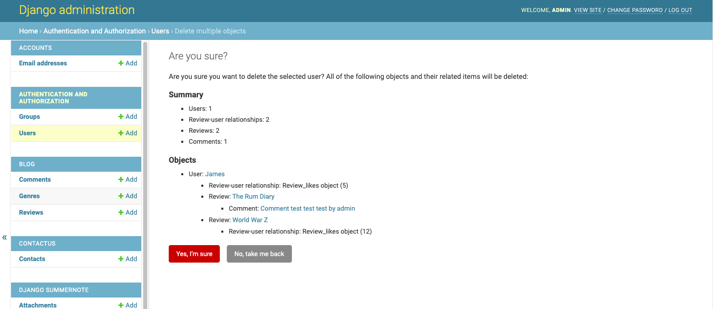
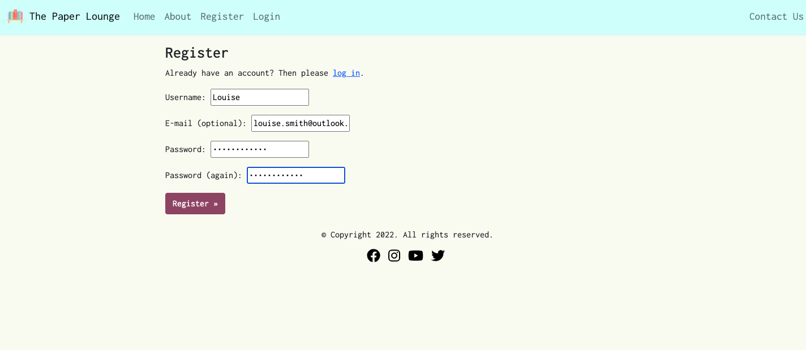
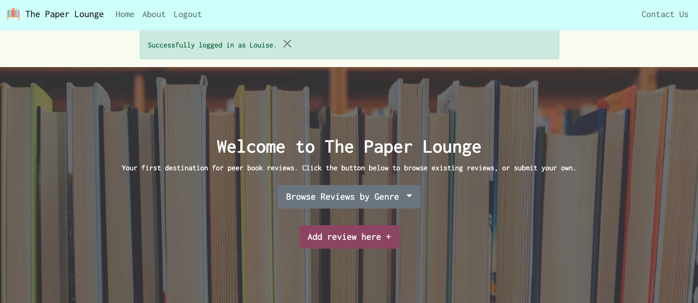
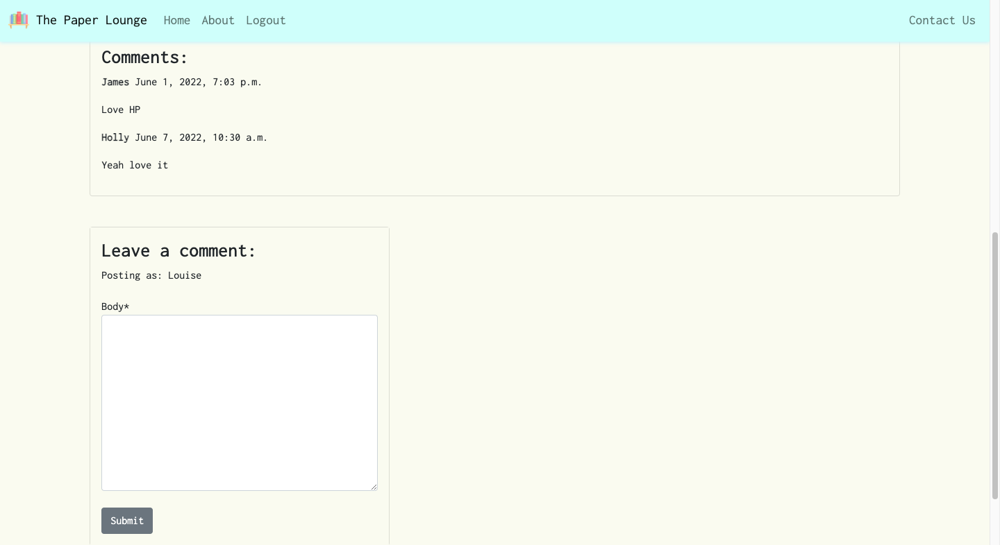
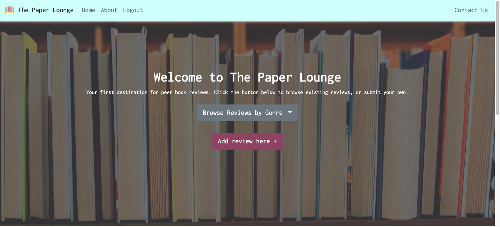

## Table of contents
1. [Unit Testing](#unit-testing)
    - [Views](#views) 
    - [Forms](#forms)
- [Validator Testing](#validator-testing)
    - [Lighthouse](#lighthouse)
    - [W3C Markup](#w3c-markup)
    - [W3C-CSS](#w3c-css) 
    - [PEP8](#pep8)
- [User Story Testing](#ser-story-testing)
    - [Admin](#admin)
    - [Site User](#site-user)
- [Responsive Testing](#Responsive-Testing)
***

# Unit Testing
I have performed unit tests for some page views, and all forms.

## Views
These views were tested to ensure the correct page is rendered back to the user. 

- Homepage

- About page 

- Add Review page

Result: 

## Forms
All forms were tested to ensure that mandatory fields are identified as such, and that data is submitted to the correct location. 

- Review Form

- Comment Form

- Contact Form

Result: 

# Validator Testing 

## Lighthouse

## W3C Markup
All template files validate with no errors: 

- Home

- About

- Review detail 

- Login

- Logout

- Register

- Add review 

- Edit review 

- Genre page

- Contact us 

## W3C CSS
No errors were found in the custom css. There were seven warnings raised, however these relate to Google Fonts and extensions. 

## PEP8 
No errors were found in the python code. In settings.py there were some long line errors which were unavoidable, and in models.py there were some continuation lines marked where I had resolved some long line errors. 

- admin.py (Contact Us app)

- admin.py (Blog app)

- apps.py (Contact Us app)

- apps.py (Blog app app)

- forms_test.py

- forms.py (Contact Us app)

- forms.py (Blog app)

- manage.py

- models.py (Contact Us app)

- models.py (Blog app)

- settings.py

- urls.py (Blog app)

- urls.py (Contact Us app)

- urls.py

- views.py (Contact Us app)

- views.py (Blog app)

- views_test.py

- wsgi.py

# User Story Testing 

## Admin 

- As a site admin I can access the admin panel from the navigation when logged in so that I don't have to manually type the URL each time. 

When the admin is logged in, a link to the Admin Panel is present on the nav bar. When clicked this takes the admin straight to the admin panel. This link only shows for the admin, and is not accessible to any other user. 

 

- As a site admin I can approve reviews and comments so that suitability of content can be ensured.

Within the admin panel, the admin can select Reviews or Comments:

Comments can be selected and then approval can be performed via the dropdown menu:

Reviews can be selected, and then approved and published: 

Once approved and published, reviews and comments will become visible to all users on the site. 

 

- As a site admin/user I can create book reviews to share with other users.

Within the admin panel, the admin can select Reviews:

'Add Review' can then be selected:

The review can then be submitted via the form. It still needs to be approved and published before it appears on the site: 

 

- As a site admin/user I can update and delete reviews written by me so that I can manage my own content.

Within the admin panel, the admin can select Reviews:

Here, the admin can edit or delete their review: 

 

- As a site admin I can manage genres so that I can add to, modify or remove them

Within the admin panel, the admin can select Genres:

Here, new genres can be added or existing genres can be edited or deleted:

 

- As a site admin I can view messages submitted via the contact form so that I can communicate with site users.

Within the admin panel, the admin can select Contacts:

Here, the admin can click into messages to read them: 

 

- As a site admin I can remove users so that they will no longer be able to post unsuitable content.

Within the admin panel, the admin can select Users: 

Here, the admin can select users to delete: 

The admin is then informed that all objects related to that user will also be deleted, and they are asked to confirm they are sure they want to delete that user:

## Site User

- As a site user I can register for an account to be able to post reviews and comments.

The user can select 'register' from either the navigation or the homepage header:

The user can then fill out the register form and click 'Register': 

The user is then redirected to the homepage, where a pop-up message informs them that they are logged in successfully. The 'Add Review" button also appears in header:

 

- As a returning site user I can login to the website so that I can post reviews and comments.

The user can select 'log in' from either the navigation or the homepage header:

The user can log in via the form: 

The user is then redirected to the homepage, where a pop-up message informs them that they are logged in successfully. The 'Add Review" button also appears in header:

Once a user is registered and/or logged in, the comments form also becomes available in the review detail: 

 

- As a returning user I can log out my account to ensure security on any shared devices I may use.

The logged in user can select 'log out' from the navigation:

Here, the user is asked if they are sure they want to log out: 

The user is then redirected to the homepage, where a pop-up message informs them that they are logged out successfully: 

 

- As a site admin/user I can create book reviews to share with other users.

The logged in user can select 'Add review here' from the header:

The user can then fill out and submit a form, which is then sent to the admin for approval:

Upon submitting, the user is redirected to the homepage, where a pop-up message informs them that their review has been submitted for approval:

 

- As a site admin/user I can update and delete reviews written by me so that I can manage my own content.

