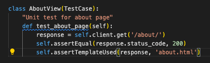
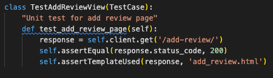
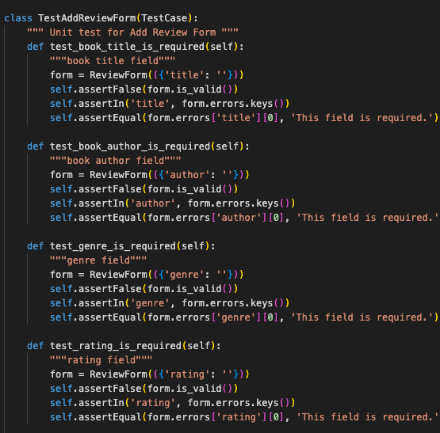
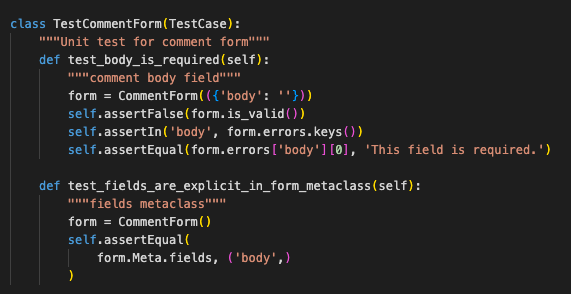
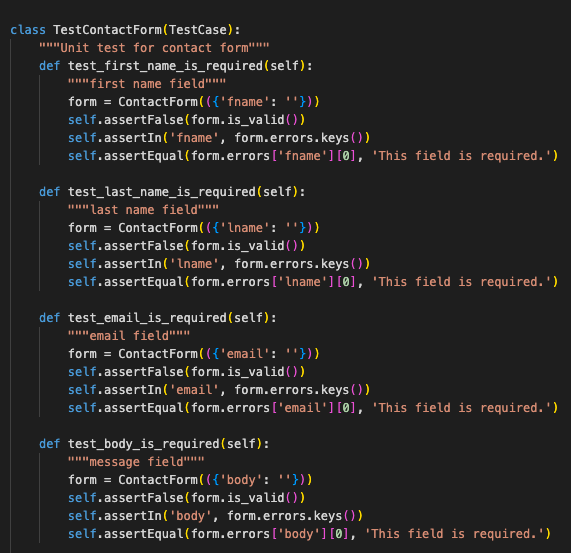

## Table of contents
1. [Unit Testing](#unit-testing)
    - [Views](#views) 
    - [Forms](#forms)
- [Validator Testing](#validator-testing)
    - [Lighthouse](#lighthouse)
    - [W3C Markup](#w3c-markup)
    - [W3C-CSS](#w3c-css) 
    - [PEP8](#pep8)
- [User Story Testing](#ser-story-testing)
    - [Admin](#admin)
    - [Site User](#site-user)
- [Responsive Testing](#Responsive-Testing)
***

# Unit Testing
I have performed unit tests for some page views, and all forms.

## Views
These views were tested to ensure the correct page is rendered back to the user. 

- Homepage

- About page 

- Add Review page

Result: 

## Forms
All forms were tested to ensure that mandatory fields are identified as such, and that data is submitted to the correct location. 

- Review Form

- Comment Form

- Contact Form

Result: 

# Validator Testing 

## Lighthouse

