## Table of contents
1. [Unit Testing](#unit-testing)
    - [Views](#views) 
    - [Forms](#forms)
- [Validator Testing](#validator-testing)
    - [Lighthouse](#lighthouse)
    - [W3C Markup](#w3c-markup)
    - [W3C-CSS](#w3c-css) 
    - [PEP8](#pep8)
- [User Story Testing](#ser-story-testing)
    - [Admin](#admin)
    - [Site User](#site-user)
- [Responsive Testing](#Responsive-Testing)
***

# Unit Testing
I have performed unit tests for some page views, and all forms.

## Views
These views were tested to ensure the correct page is rendered back to the user. 

- Homepage

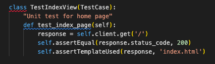

- About page 

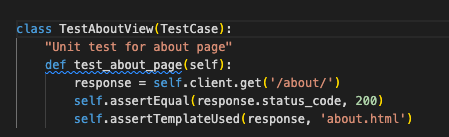

- Add Review page

Result: 

## Forms
All forms were tested to ensure that mandatory fields are identified as such, and that data is submitted to the correct location. 

- Review Form

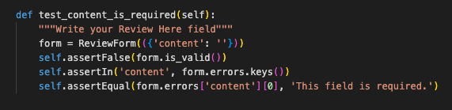

- Comment Form

- Contact Form

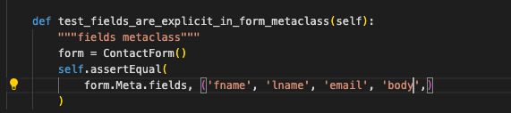

Result: 

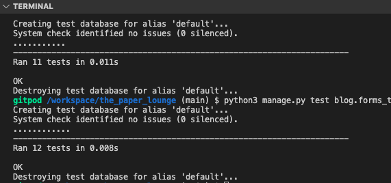

# Validator Testing 

## Lighthouse

## W3C Markup
All template files validate with no errors: 

- Home

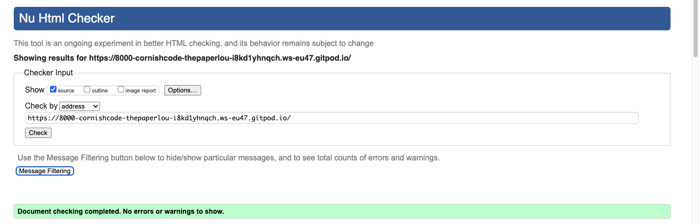

- About

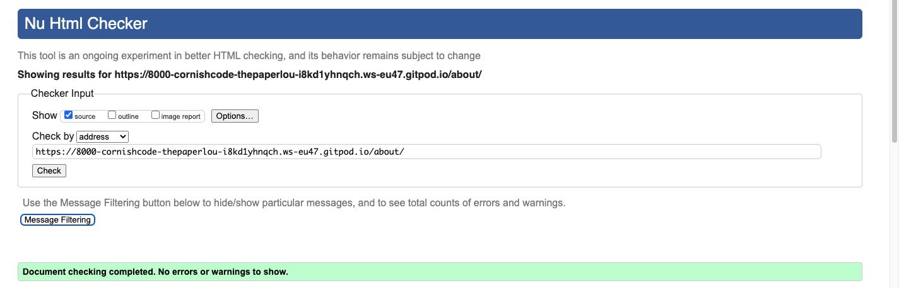

- Review detail 

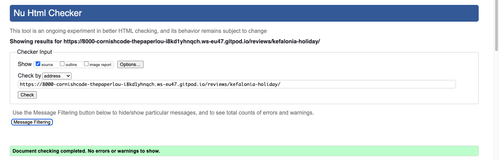

- Login

- Logout

- Register

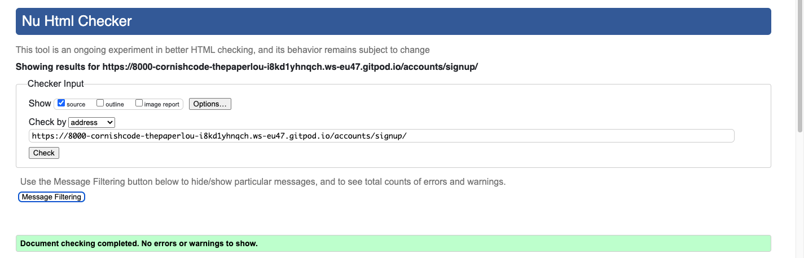

- Add review 

- Edit review 

- Genre page

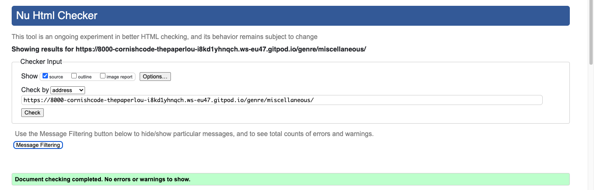

- Contact us 

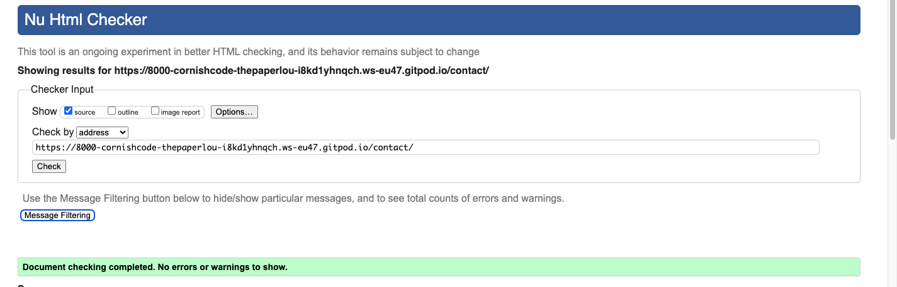

## W3C CSS
No errors were found in the custom css. There were seven warnings raised, however these relate to Google Fonts and extensions. 

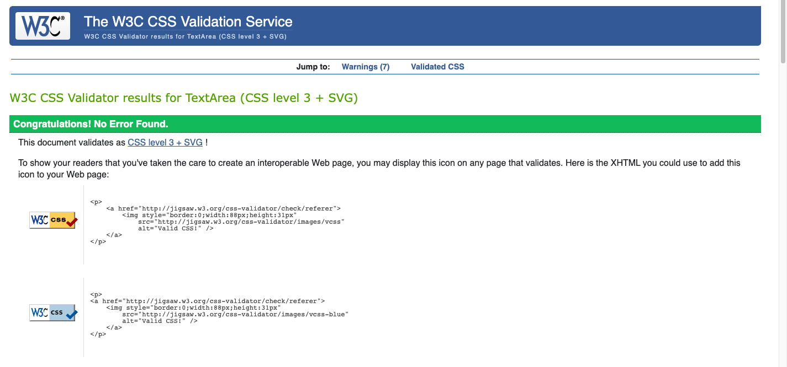

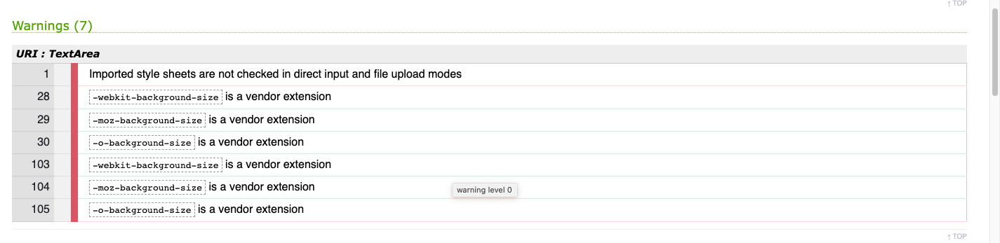

## PEP8 
No errors were found in the python code. In settings.py there were some long line errors which were unavoidable, and in models.py there were some continuation lines marked where I had resolved some long line errors. 

- admin.py (Contact Us app)

- admin.py (Blog app)

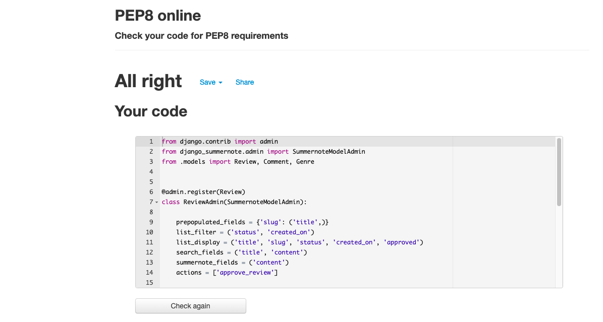

- apps.py (Contact Us app)

- apps.py (Blog app app)

- forms_test.py

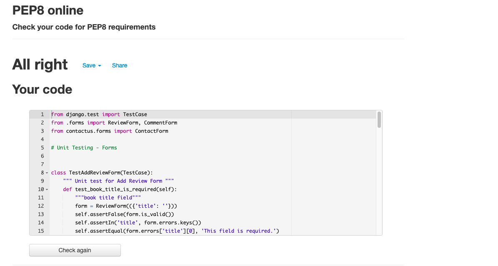

- forms.py (Contact Us app)

- forms.py (Blog app)

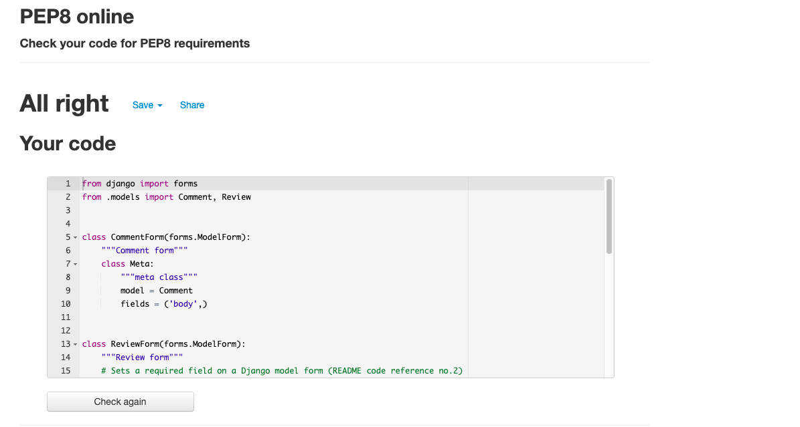

- manage.py

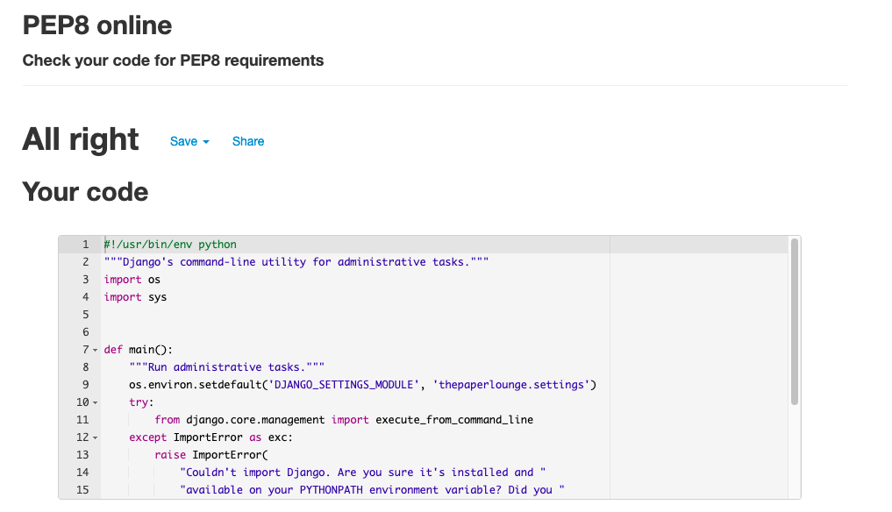

- models.py (Contact Us app)

- models.py (Blog app)

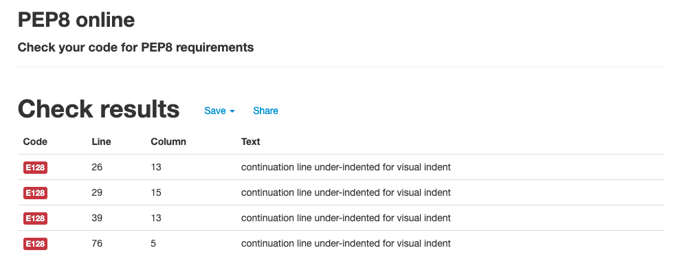

- settings.py

- urls.py (Blog app)

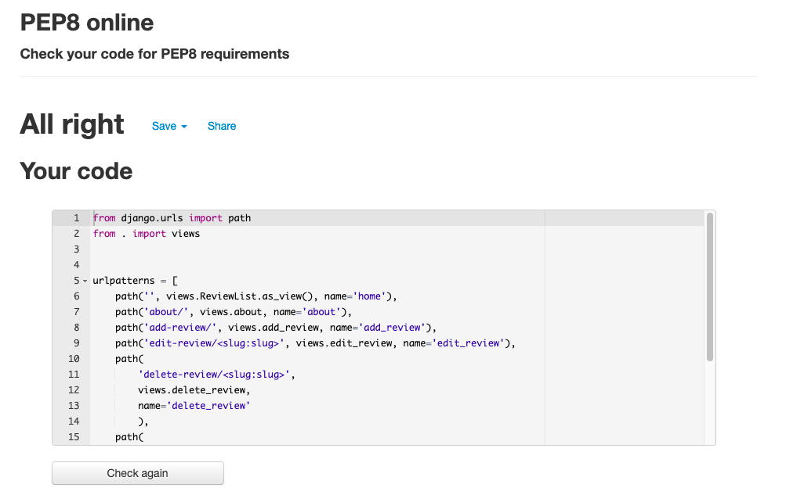

- urls.py (Contact Us app)

- urls.py

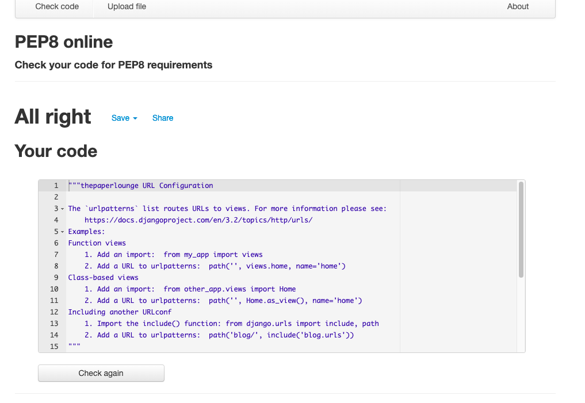

- views.py (Contact Us app)

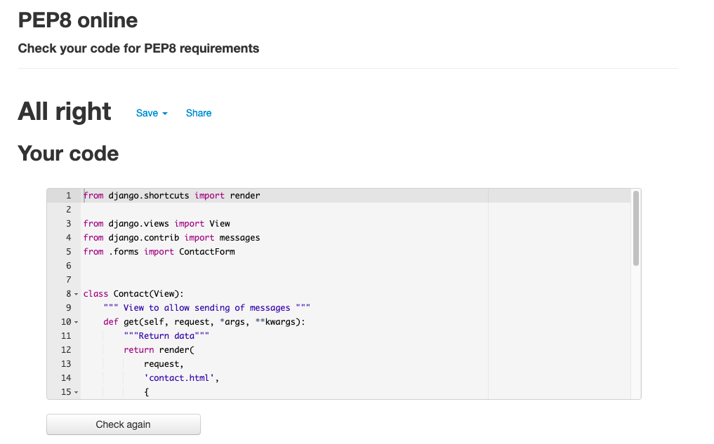

- views.py (Blog app)

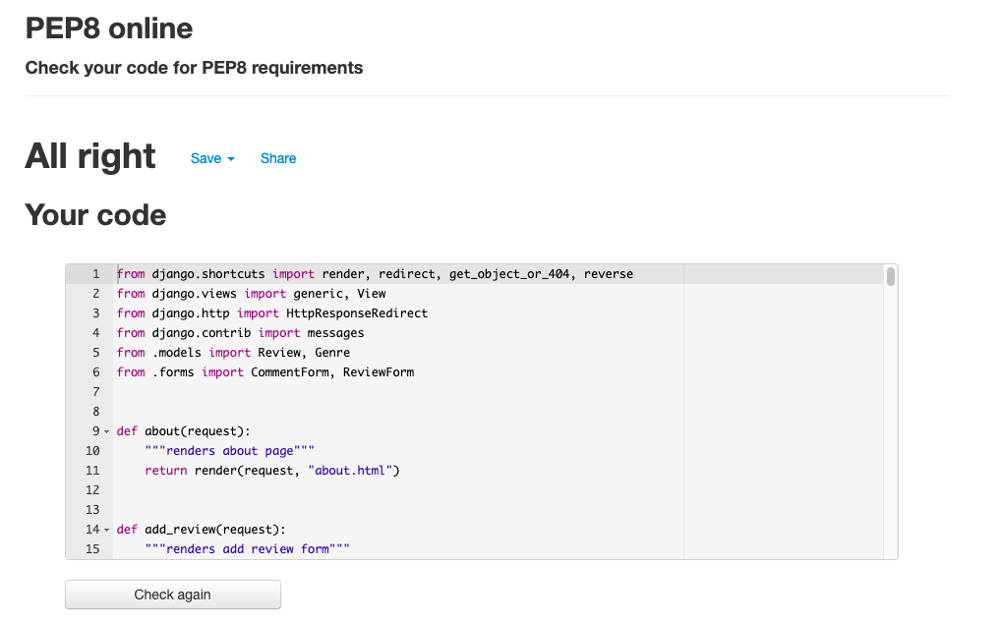

- views_test.py

- wsgi.py

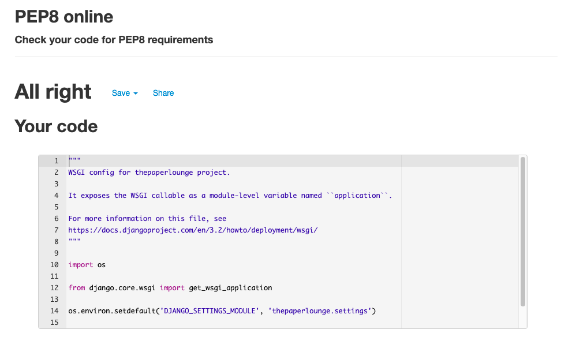