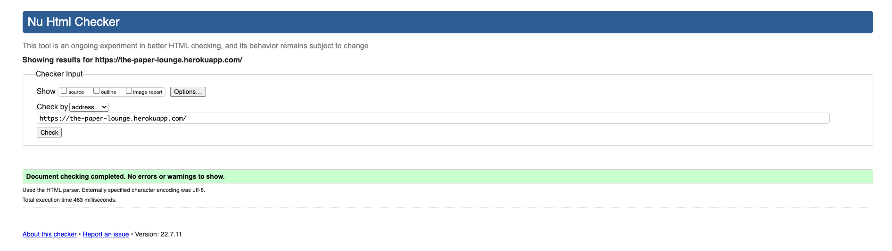
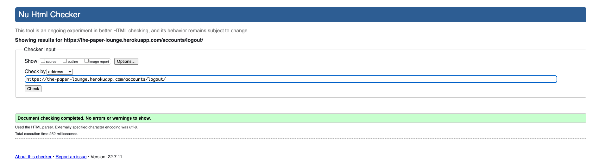
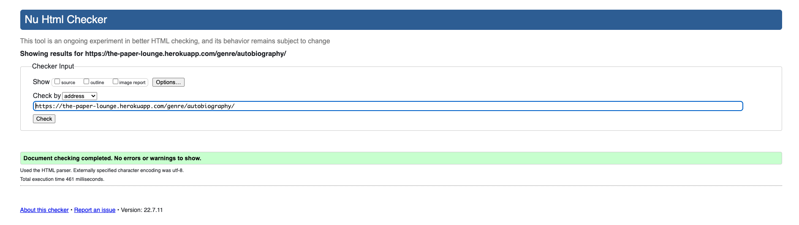
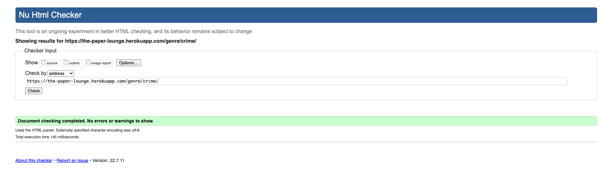
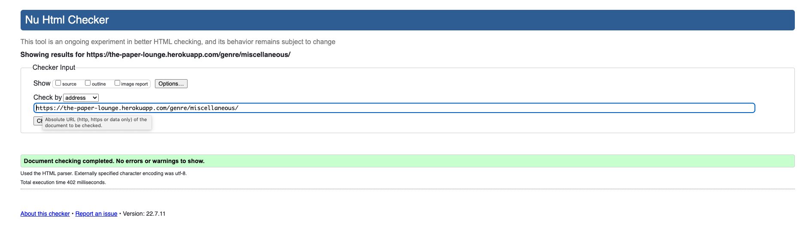
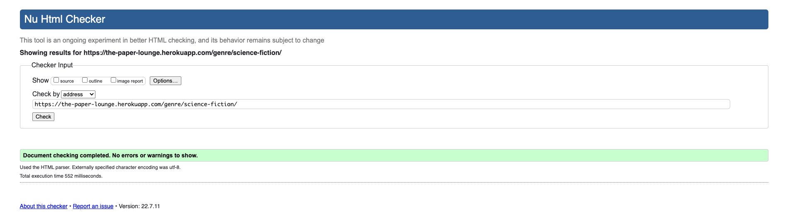
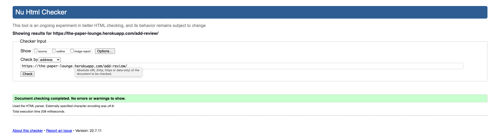
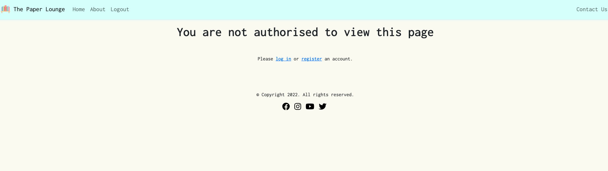

## Table of contents
- [Validator Testing](#validator-testing)
    - [W3C Markup](#w3c-markup)
- [Defensive Validation](#defensive-validation)
    - [Edit Review page](#edit-review-page)
    - [Delete Modal](#delete-modal)

# Validator Testing 

## W3C Markup

Upon assessment, it was found that several of the deployed URLs did not pass validation. This file documents the testing of the URLs carried out prior to re-submission.

- Home

- About

- Register

- Login

- Logout

- Contact

- Anime

- Autobiography

- Crime

- Fantasy

- Horror

- Miscellaneous

- Mystery

- Romance

- Science-Fiction

- Teen

- Thriller

- Add Review

- Edit Review

- Review Detail

# Defensive Validation

## Edit Review page
Users can now only access a review's edit page via it's URL if they are the creator of that review. If a user tries to access any other edit page via it's URL, they are informed that they are not authorised to view that page: 

If a non-logged in guest attempts to access an edit page, they are prompted to log in. If upon login they are identified as the creator of that review, they are taken to the edit page. Otherwise, they are taken to the page screenshot above.

This was achieved by implementing an if/else statement in template 'edit_review.html' (lines 12-33), and adding a login_required decorator to the 'edit_review' view in views.py.

## Delete Modal
An error identified by the assessor was that any user or guest could access the delete modal in developer tools, and delete any of the reviews. This has now been resolved so that only the creator of a review can access this via the developer tools. If a user is viewing a review that is not their own, the edit and delete buttons and the delete modal are not visible or accessible in developer tools. This was achieved by implementing an if statement in template 'review_detail.html' (lines 26-58), and adding a login_required decorator to the 'delete_review' view in views.py.

